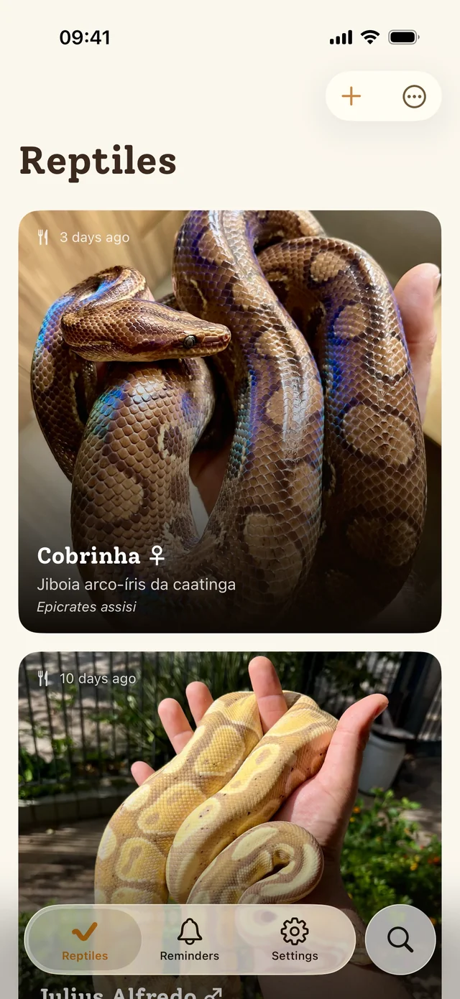
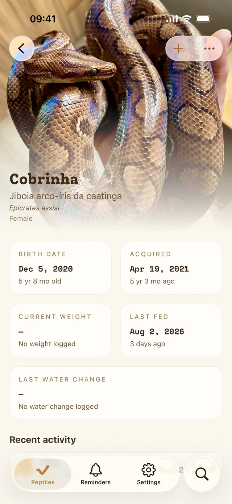
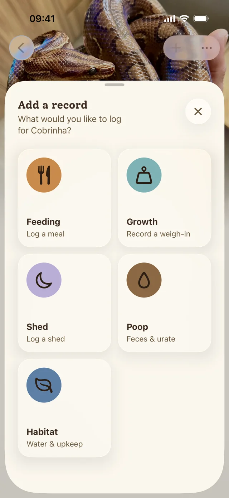
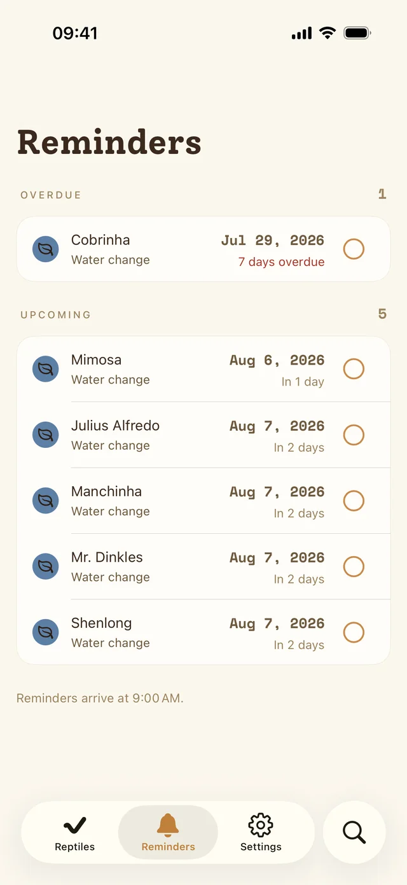

<p align="center">
  <picture>
    <source media="(prefers-color-scheme: dark)" srcset="assets/logo-dark-transparent.svg">
    <source media="(prefers-color-scheme: light)" srcset="assets/logo-light-transparent.svg">
    
  </picture>
</p>

# ReptiKeep

ReptiKeep is an app for managing the care of your reptiles. Reminders for feeding, water changes, cleaning, and a place to jot down the everyday stuff that matters. It keeps each animal's care history in one place and helps answer the everyday questions: Who needs attention? When did this one last eat? Is their weight moving in the right direction?

I'm building this app around my own needs as a reptile keeper. That means it's offline-first and respects your privacy — no account required, no data leaves your device unless you choose otherwise. Everything you log stays on your phone.

Right now the app is fully local. Eventually I plan to offer an optional, paid sync server for people who want to access their data from multiple devices or the web and keep everything in sync — or for households where more than one person takes care of the same animals.

## Screenshots

<p align="center">
  
  
  
  
</p>

## What it does

- A profile for each reptile: species, sex, photo, birth date, and when you got them
- Log feedings, weigh-ins, sheds, waste, water changes, and enclosure upkeep
- Backdate records — because nobody logs things in real time while holding a snake
- Per-animal timeline with feeding status and weight trends
- Feeding and water-change schedules that learn from your habits
- A reminders screen that collects everything due or overdue, with optional daily notifications
- English and Brazilian Portuguese, light or dark mode

## Project status

ReptiKeep is under active development and focused on iOS for now. Android is next! I'll start on it once the iOS public beta is out.

## Running it locally

ReptiKeep uses Expo SDK 57 and needs Node.js 22. Since it uses native SwiftUI components and MMKV storage, you'll need a local development build. No Expo Go here :)

```sh
npm install
npm run ios
```

Useful checks:

```sh
npm test
npm run lint
npm run format
```

## Built with

- [Expo](https://expo.dev/) and React Native
- [Expo Router](https://docs.expo.dev/router/introduction/)
- [Expo UI](https://docs.expo.dev/versions/v57.0.0/sdk/ui/) for native SwiftUI views
- [Legend State](https://legendapp.com/open-source/state/v3/) and MMKV for local state and persistence
- [i18next](https://www.i18next.com/) for localization

## Contributing

The project is still taking shape, so opening an issue is the best way to start a conversation about a bug or a bigger change. Small, focused pull requests are welcome.

## A note on AI

I'm a software developer. My day job decided to go all-in on AI, so I figured I'd meet it on my own terms. Learn what these tools can and can't do, try different models, understand the ecosystem properly, and actually have some fun with it. ReptiKeep became that playground.

AI wrote a lot of the code here, but I review everything that gets committed. Not every line came from a model as some things you just want to write yourself. This project is as much about learning how to work well alongside these tools as it is about building something useful.
